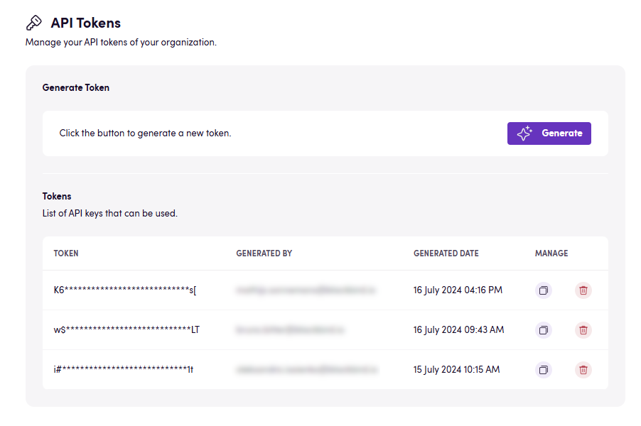
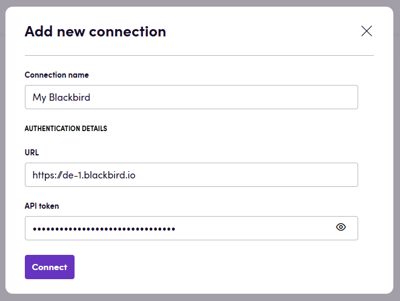
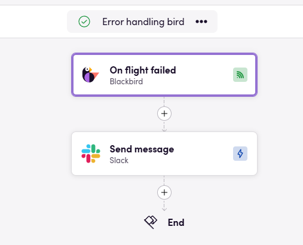

# Blackbird.io Blackbird Service API

Blackbird is the new automation backbone for the language technology industry. Blackbird provides enterprise-scale automation and orchestration with a simple no-code/low-code platform. Blackbird enables ambitious organizations to identify, vet and automate as many processes as possible. Not just localization workflows, but any business and IT process. This repository represents an application that is deployable on Blackbird and usable inside the workflow editor.

## Introduction

<!-- begin docs -->

This is the Blackbird Service API app for Blackbird. We can hear you thinking, isn't that a bit too Blackbird-ception? On the contrary! With the Blackbird Service API app you can orchestrate workflows that involve Blackbird itself. Common use cases are Flight logging, error handling and user management.

With the Blackbird app you can connect to _any_ Blackbird instance independent of hosted environment or organization. This means that you are not limited to your own organization.

## Before setting up

Before you can connect you need to make sure that:

- You have admin privileges on the Blackbird instance you want to connect to.

## Obtaining an API key

- While logged in to your Blackbird organization, click on the user icon on the top right and select _Organization management_.
- Click on _API Tokens_ in the panel on your left.
- Click _Generate_
- Copy the token that you just generated by clicking on the copy button under _Manage_.

## Connecting

1. Navigate to apps and search for Blackbird. Select the Blackbird app.
2. Click _Add connection_
3. Give your connection a name.
4. Under Instance, select which instance of Blackbird you are using, for example Europe (eu-1) (_https://eu-1.blackbird.io_).
5. Under API token, fill in the API token you have just created.
6. Click _Connect_.

## Actions

### Admin

- **Get latest notifications** Gets the latest notifications across all nests

### Users

- **Search users** Searches all users
- **Get user** Gets details about a specific user

### Nests

- **Search Nests** Searches all nests
- **Get Nest** Gets details about a specific nest
- **Add user to Nest** Adds a user to a specific nest
- **Remove user from Nest** Removes a user from a specific nest

### Birds

- **Search Birds** Searches for birds in a specific nest
    Advanced settings:
  - **Trigger type**: Filter birds by trigger type.
  - **Status**: Filter birds by status.
- **Get Bird** Gets details about a specific bird
- **Get Bird logs** Gets logs for a specific bird
- **Fly Bird** Starts a flight for a published bird with a manual trigger

### Flights

- **Search Flights** Searches for flights belonging to a specific bird
    Advanced settings:
  - **Minimum start date**: Filter flights that started on or after this date.
  - **Maximum start date**: Filter flights that started on or before this date.
- **Check for other active Flights** Checks whether the current bird has other active flights and outputs their IDs
- **Get Flight** Gets details about a specific flight
- **Get Flight Logs** Gets logs for a specific flight

## Events

### Birds

- **On Bird activated** On a bird being activated
- **On Bird published** On a bird being published
- **On Bird suspended** On a bird being suspended

### Flights

- **On Flight started** On a flight being started
    Advanced settings:
  - **Nest ID**: Limit events to flights in a specific nest.
  - **Bird IDs**: Limit events to specific birds.
  - **Bird status**: Limit events to flights whose birds have a specific status.
- **On Flight succeeded** On a flight succeeding
- **On Flight failed** On a flight failing

### Nests

- **On Nest created** On a nest being created
- **On Nest deleted** On a nest being deleted
- **On user added to Nest** On a user being added to a nest
- **On user removed from Nest** On a user being removed from a nest

### Notifications

- **On Notification received** On a notification being received
    Advanced settings:
  - **Notification type**: Limit events to a specific notification type.

## Examples

### Error handling

This incredibly simple Bird will send a notification in Slack when any Flight fails. This can be useful for alerting people about possible issues. An alternative, or suplementary action to Slack would be logging a ticket in f.e. Jira.

## Feedback

Do you want to use this app or do you have feedback on our implementation? Reach out to us using the [established channels](https://www.blackbird.io/) or create an issue.

<!-- end docs -->
