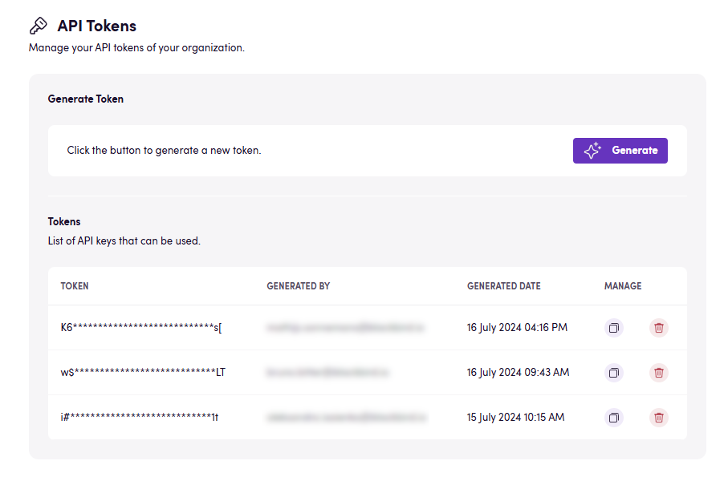
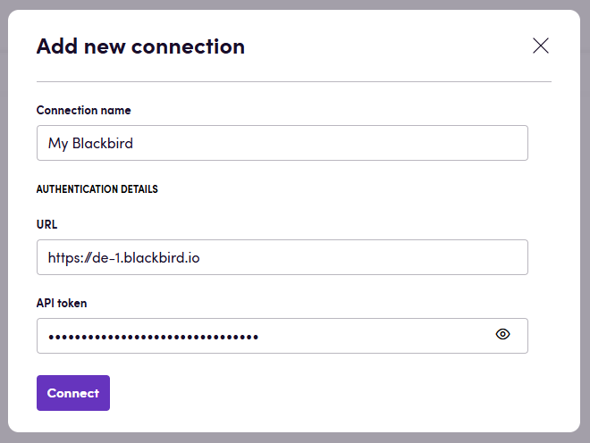
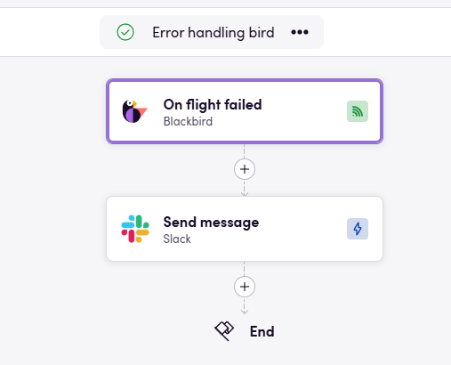

# Blackbird.io Blackbird

Blackbird is the new automation backbone for the language technology industry. Blackbird provides enterprise-scale automation and orchestration with a simple no-code/low-code platform. Blackbird enables ambitious organizations to identify, vet and automate as many processes as possible. Not just localization workflows, but any business and IT process. This repository represents an application that is deployable on Blackbird and usable inside the workflow editor.

## Introduction

<!-- begin docs -->

This is the Blackbird app for Blackbird. We can hear you thinking, isn't that a bit too Blackbird-ception? On the contrary! With the Blackbird app you can orchestrate workflows that involve Blackbird itself. Common use cases are flight logging, error handling and user management.

With the Blackbird app you can connect to _any_ Blackbird instance independent of hosted environment or organization. This means that you are not limited to your own organization.

## Before setting up

Before you can connect you need to make sure that:

- You have admin privileges on the Blackbird instance you want to connect to.

## Obtaining an API key

- While logged in to your Blackbird organization, click on the user icon on the top right and select _Organization management_.
- Click on _API Tokens_ in the panel on your left.
- Click _Generate_
- Copy the token that you just generated by clicking on the copy button under _Manage_.

## Connecting

1. Navigate to apps and search for Blackbird. Select the Blackbird app.
2. Click _Add connection_
3. Give your connection a name.
4. Under URL, fill in the base URL of your Blackbird instance. F.e. _https://de-1.blackbird.io_.
5. Under API token, fill in the API token you have just created.
6. Click _Connect_.

## Actions

### Users
- **Search users** returns all the users of the connected organization.
- **Get user** returns information about a particular user.
- **Add user to nest** adds the user to a nest.
- **Remove user from nest** removed the user from said nest.

### Nests
- **Search nests** returns all the nests of the connected organization.
- **Get nest** returns information about a particular nest.

### Birds
- **Search birds** returns all the birds inside a particular nest. You can optionally filter by the bird status and the trigger type.
- **Get bird** returns information about a particular bird.
- **Start bird** starts a new flight of this bird. Note: this only works for birds with manual triggers at the moment.

### Flights
- **Search flights** returns all the flights of a particular bird. You can optionally filter for flights within a specific time frame. You can also filter by flight status.
- **Get flight** returns information about a particular flight.

## Events

### Birds
- **On bird activated** is triggered when a bird is activated (status changed from _suspended_ to _active_)
- **On bird published** is triggered when a new version of a bird is published
- **On bird suspended** is triggered when a bird is suspended (status changed from _active_ to _suspended_)

### Flights
- **On flight started** is triggered when a flight has started.
- **On flight succeeded** is triggered when a flight completes succesfully.
- **On flight failed** is triggered when a flight failed. See example below.

With bird and flight events you can optionally select the nest you want to watch. Note that bird and flight events cannot trigger themselves. You therefore don't have to worry about infinite loops.

### Nests
- **On nest created** is triggered when a new nest is created
- **On nest deleted** is triggered when a nest is deleted
- **On user added to nest** is triggered when a user is added to a nest.
- **On user removed from nest** is triggered when a user is removed from a nest.

## Examples

### Error handling

This incredibly simple bird will send a notification in Slack when any flight fails. This can be useful for alerting people about possible issues. An alternative, or suplementary action to Slack would be logging a ticket in f.e. Jira.

## Feedback

Do you want to use this app or do you have feedback on our implementation? Reach out to us using the [established channels](https://www.blackbird.io/) or create an issue.

<!-- end docs -->
